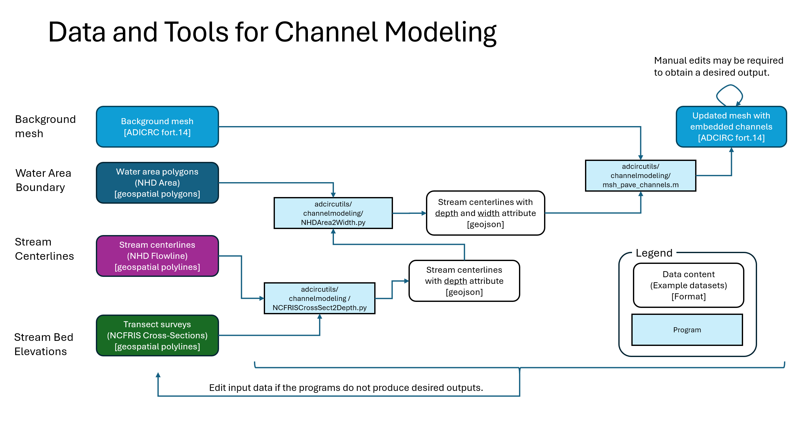

# Channel Mesh Paving Example

This example demonstrates the channel paving process using tools in `adcircutils/channelpaving`. It provides a sample setup to showcase how to model and pave a channel in a background mesh for ADCIRC simulations.

## Overview

The channel paving example demonstrates the process to generate an ADCIRC mesh file that incorporates channels using vertical eleemnt walls and 1D condensation techniques from input files including a background mesh, water area polygon, stream centerlines, and stream bed elevation data. In this example, the datasets and tools indicated in the following figure are used.



## Files and Directories

- `P00_uncompress_files.sh`: Shell script to uncompress input/output files.
- `P01_add_depth_and_width_to_centerlines.ipynb`: Jupyter notebook to add depth and width attributes to stream centerline geospatial file.
- `P02_add_channel_mesh_to_bg_mesh.mlx`: Matlab live script to add a channel mesh to a background mesh.
- `P99_compress_files.sh`: Shell script to compress input/output files.
- `./input`: Stores input files.
- `./output`: Stores output files.

## Usage

1. Install the author's fork of OceanMesh2D:
    ```bash
    cd <directory_to_install_OceanMesh2D>
    git clone https://github.com/shinbunya/OceanMesh2D.git OceanMesh2D
    cd OceanMesh2D
    git checkout shintaro
    ```

2. Install the author's fork of mesh2d:
    ```bash
    cd <directory_to_install_mesh2d>
    git clone https://github.com/shinbunya/mesh2d.git mesh2d
    cd mesh2d
    ```

3. Uncompress input/output files if you have not done that yet.
    ```bash
    bash P00_uncompress_files.sh
    ```

4. Add depth and width attributes to stream centerlines. 
    - Open and execute Jupyter notebook [`P01_add_depth_and_width_to_centerlines.ipynb`](P01_add_depth_and_width_to_centerlines.ipynb).
    - Check the `pt_depth` and `pt_width` fields in the generated `output/nhdp_hr_sample_roanoke_1_DP_WD.geojson` file.

5. Add a channel mesh to a background mesh
    - Open and run [`P02_add_channel_mesh_to_bg_mesh.mlx`](P02_add_channel_mesh_to_bg_mesh.mlx) in MATLAB. This may take about 30 min or longer depending on your computing environment.
    - Check the generated grid file, `output/ncv30.01a_roanoke.grd`, by your favorite mesh viewer.

## License

This example is provided under the same license as the `adcircutils` repository. Refer to the main repository for licensing details.